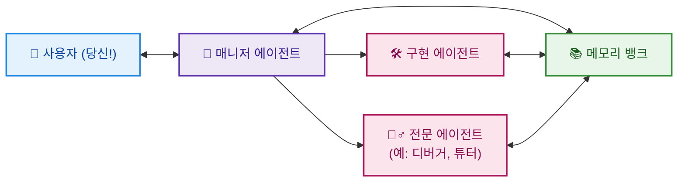

# 에이전트 기반 프로젝트 관리 (APM)

 

*AI 비서 팀과 함께 복잡한 프로젝트를 원활하고 효율적으로 관리하세요.*

## APM이란 무엇인가요?

**에이전트 기반 프로젝트 관리(APM)**는 실제 프로젝트 관리 원칙을 AI 지원 워크플로우에 통합하는 프레임워크입니다. Cursor, ChatGPT, Claude와 같은 AI 코딩 비서를 개발, 연구 또는 기타 복잡한 작업에 사용하고 있다면, APM은 전문화된 AI 에이전트 팀을 조정할 수 있는 구조화되면서도 유연한 방법을 제공합니다.

이는 AI가 지원하는 프로젝트 관리자, 개발자 및 전문가 팀이 여러분의 지시에 따라 함께 작업하는 것과 같습니다.

## 왜 APM인가요?

AI와 함께 큰 프로젝트를 진행하는 것은 복잡해질 수 있습니다. 컨텍스트가 손실되고, 에이전트가 지시를 잊어버리며, 끝없이 반복하는 것처럼 느껴질 수 있으며, 이는 종종 높은 토큰 사용량과 비용으로 이어집니다. APM은 다음을 통해 이 문제를 해결합니다.

*   **실제 팀 모방:** 명확한 역할(매니저, 구현자)과 입증된 프로세스를 사용하여 AI 협업을 더욱 직관적으로 만듭니다.
*   **스마트 에이전트 관리:** APM은 **메모리 뱅크**(공유 프로젝트 로그북), 일관된 에이전트 동작을 위한 상세한 **마크다운 프롬프트**, 그리고 집중적인 작업을 위한 **전문 에이전트** 개념과 같은 기술을 통합합니다. 이는 견고한 오류 처리 기능을 갖춘 정교한 워크플로우를 제공합니다.
*   **효율적이고 예산 친화적:** APM은 균형을 목표로 합니다. 간소화되고 비용 효율적으로 설계되어 토큰이나 API 요청을 "소모"하지 않고도 훌륭한 결과를 얻을 수 있도록 돕습니다.
*   **사용자 중심 제어:** 이 시스템은 여러분을 주도적인 위치에 놓습니다. 중요한 지점에서 사용자 지침과 감독을 강조합니다. 에이전트가 어려움을 겪거나 컨텍스트 한계에 도달하면, APM은 **핸드오버 프로토콜**(새로운 에이전트로 원활하게 전환하기 위함)과 같은 명확한 솔루션을 제공하며, 전체 워크플로우를 정렬하기 위해 **메모리 뱅크 시스템**에 의존합니다.

## 시작하기:

다음은 핵심 APM 프레임워크를 프로젝트에 설정하고 실행하는 방법입니다.

**APM 자산 접근:** APM 프롬프트, 가이드 및 프로토콜 정의를 얻는 몇 가지 옵션이 있습니다.

1.  **APM 템플릿 사용 (사용자 정의 프로젝트에 권장):**
    *   [APM GitHub 저장소](https://github.com/sdi2200262/agentic-project-management)에서 "Use this template" 버튼을 클릭합니다.
    *   이렇게 하면 전체 APM 구조가 미리 채워진 **자신만의 저장소**가 생성됩니다.
    *   **이상적인 설정:** **새 저장소**를 프로젝트 워크스페이스의 루트에 복제합니다. 이렇게 하면 매니저 에이전트가 모든 APM 가이드에 쉽게 접근할 수 있습니다.
2.  **공식 APM 저장소 복제 (직접 사용 및 업데이트에 권장):**
    *   메인 [APM GitHub 저장소](https://github.com/sdi2200262/agentic-project-management)를 프로젝트 워크스페이스의 루트에 직접 복제합니다.
    *   이렇게 하면 최신 버전과 모든 자산에 직접 접근할 수 있습니다.
3.  **수동 복사-붙여넣기 (기본 사용):**
    *   `01_Initiation_Prompt.md`와 같은 프롬프트의 내용을 공식 APM GitHub 저장소에서 필요에 따라 AI 비서에 직접 복사하여 붙여넣을 수 있습니다.
    *   이 방법도 작동하지만, 매니저 에이전트가 요청할 때마다 가이드 내용을 수동으로 제공해야 하므로 더 많은 노력이 필요합니다.

**어떤 방법을 선택하든, 핵심은 APM 자산(특히 `prompts/` 디렉토리)이 지속적으로 접근 가능해야 하며, 매니저 에이전트가 전체 파일 인식을 가지고 작동하도록 하려면 프로젝트 워크스페이스의 루트에 있는 것이 이상적입니다.**

**프로젝트 내 APM 시작:**

1.  **매니저를 위한 초기 프롬프트:** `prompts/00_Initial_Manager_Setup/01_Initiation_Prompt.md`로 이동합니다 (복제한 APM 저장소, 템플릿 기반 저장소 또는 GitHub 웹사이트에서).
2.  **복사 및 붙여넣기:** **전체 내용**을 복사합니다.
3.  **매니저 에이전트 실행:** 이 내용을 기본 AI 비서(예: 새 Cursor 채팅 탭)에 **첫 번째 메시지**로 붙여넣습니다. 이 AI는 이제 첫 번째 APM 매니저 에이전트가 됩니다!
4.  **안내 따르기:** 새 매니저 에이전트는 이 프롬프트의 안내에 따라 프로젝트를 이해하고 구현 계획과 메모리 뱅크 시스템 설정을 시작하기 위해 질문할 것입니다.

**선택 사항: Cursor 규칙으로 APM 강화 (Cursor 사용자에게 권장)**

*   **Cursor IDE**를 사용하고 있다면, APM은 `rules/` 디렉토리(또는 프로젝트 워크스페이스의 `.cursor/rules/`)에 사전 정의된 [Cursor 규칙](https://docs.cursor.com/context/rules) 세트를 제공하여 컨텍스트 윈도우 사용량에 미치는 영향을 최소화하면서 에이전트의 신뢰성과 워크플로우 효율성을 향상시킵니다.
*   이 규칙들은 APM 워크플로우의 특정 지점을 목표로 하여 매니저와 구현 에이전트에게 컨텍스트 강화를 제공합니다.
*   쉬운 설정 지침은 `rules/README.md` 및 [Cursor 통합 가이드](docs/04_Cursor_Integration_Guide.md)를 참조하세요.
*   **다른 IDE를 위한 개념:** IDE별로 영구적이고 범위가 지정된 지침을 사용하는 원칙은 Windsurf, Roo 등 유사한 규칙 또는 사용자 정의 지침 기능을 제공하는 다른 AI 통합 IDE에도 적용될 수 있습니다. 다른 플랫폼에서 실행 가능한 접근 방식을 탐색하고 발견한다면, APM GitHub 저장소에 이슈를 열거나 풀 리퀘스트를 제출하여 통찰력을 공유하는 것을 고려해주세요!

## 더 자세히 알아보기

이 README는 필수적인 내용을 제공합니다. APM 워크플로우, 고급 기능, 사용자 정의 및 각 구성 요소의 기술적 세부 사항에 대한 더 깊은 이해를 위해서는 다음을 참조하세요.

*   🚀 **[전체 APM 문서](docs/)** - 포괄적인 가이드입니다.
*   ⚙️ **[예제 Cursor 규칙](rules/)** - Cursor IDE를 사용하는 경우 APM을 향상시키는 선택적 규칙입니다. 작동 방식에 대한 `rules/README.md`를 확인하세요.
*   🖱️ **[Cursor 통합 가이드](docs/04_Cursor_Integration_Guide.md)** - Cursor 내에서 APM을 최적으로 사용하는 팁(프로젝트별 규칙 설정 포함).

*(또는 [여기서](https://github.com/sdi2200262/agentic-project-management) 프롬프트와 문서를 직접 찾아볼 수도 있습니다.)*

## 기여하기

APM은 오픈소스 프로젝트이며, 여러분의 아이디어를 환영합니다! 프롬프트 개선, 문서 강화, 새로운 기능 제안, 버그 보고, 흐름의 결함 또는 기타 문제가 있다면 언제든지 이슈를 열거나 풀 리퀘스트를 제출해 주세요.

행동 강령 및 기여 방법에 대한 자세한 내용은 [CONTRIBUTING.md](CONTRIBUTING.md)를 참조하세요.

## 라이선스

이 프로젝트는 MIT 라이선스에 따라 라이선스가 부여됩니다. 자세한 내용은 [LICENSE](LICENSE) 파일을 참조하세요.

  

## 버전 0.3.0의 주요 개선 사항

버전 0.3.0은 견고성, 에이전트 출력 일관성, 계획의 명확성, 그리고 핸드오버 중 컨텍스트 전달의 신뢰성을 향상시키는 데 중점을 둡니다. 주요 변경 사항은 다음과 같습니다.

*   **향상된 메모리 시스템:**
    *   일관성을 보장하고 오관리를 방지하기 위해 `Implementation_Plan.md`에 대한 메모리 뱅크 구조(디렉토리, 로그 파일)의 엄격한 유효성 검사(`prompts/01_Manager_Agent_Core_Guides/02_Memory_Bank_Guide.md` 참조).
    *   간결하고 유익한 항목과 명확한 예시를 강조하는 `prompts/02_Utility_Prompts_And_Format_Definitions/Memory_Bank_Log_Format.md`의 개선된 로그 품질 가이드라인.
*   **더욱 상세하고 일관된 구현 계획 및 작업 할당:**
    *   `prompts/01_Manager_Agent_Core_Guides/01_Implementation_Plan_Guide.md`는 이제 다음을 의무화합니다.
        *   균형 잡힌 작업 분배와 명확성을 보장하기 위해 모든 작업에 대한 명시적인 에이전트 할당을 더욱 강조합니다.
        *   방법론적 일관성을 보장하고 더 명확한 지침을 제공하기 위해 각 작업 단계 내에 간략한 "안내 노트"(예: 핵심 메서드, 라이브러리, 매개변수)를 포함합니다.
    *   `prompts/01_Manager_Agent_Core_Guides/03_Task_Assignment_Prompts_Guide.md`는 매니저 에이전트가 구현 에이전트를 위한 상세하고 실행 가능한 작업 할당 프롬프트를 만들 때 `Implementation_Plan.md`의 "안내 노트"를 명시적으로 사용하고 확장하도록 업데이트되었습니다.
*   **더욱 강력한 핸드오버 프로토콜:**
    *   핸드오버 프로세스에는 이제 나가는 에이전트가 가장 최근의 대화 컨텍스트와 기록되지 않은 사용자 지시를 명시적으로 캡처하고 핸드오버 아티팩트에 전달하는 단계가 포함됩니다. 이를 통해 들어오는 에이전트가 가장 최신의 사용자 의도를 알 수 있습니다(`prompts/01_Manager_Agent_Core_Guides/05_Handover_Protocol_Guide.md` 참조).
    *   `prompts/02_Utility_Prompts_And_Format_Definitions/Handover_Artifact_Format.md`는 핸드오버 컨텍스트를 문서화하는 데 더 나은 가독성과 유용성을 위해 재구성되었습니다.
